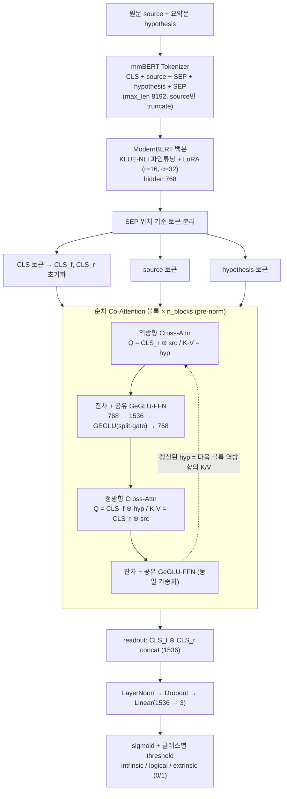

# 모델 구조 (CLSClassifier — basic_code_v4)

원문(source)·요약문(hypothesis) 쌍을 입력받아 3유형 할루시네이션
(**intrinsic** 원문 내용 왜곡 / **logical** 논리·맥락 오류 / **extrinsic** 원문에 없는 내용 추가)을
multi-label로 판정하는 인코더 기반 분류기.

## 구성 요소

| 구성 | 값 |
|---|---|
| 백본 | ModernBERT (mmBERT-base → KLUE-NLI 파인튜닝) |
| 어댑터 | LoRA r=16, α=32, targets: Wqkv·Wo·Wi (백본 동결) |
| Cross-Attention | pre-norm, 12 heads, 역방향 → 정방향 순차 co-attention |
| 공유 FFN | GeGLU (768 → 1536 → split·gate → 768), 블록 내 정·역 공유 |
| Readout | CLS 정방향·역방향 2토큰 concat → Linear → 3 logit |
| 손실 | BCEWithLogits (multi-label) |
| 추론 threshold | validation F1 최적값 (체크포인트 metadata 에 저장) |

## 핵심 설계

- **양방향 정보 교환**: 정방향이 갱신한 hyp 토큰이 다음 블록 역방향의 K/V가 되어,
  블록을 쌓을수록 역방향도 정방향 결과를 본다.
- **CLS 2개 readout**: CLS_f(요약→원문 대조 요약)와 CLS_r(원문→요약 대조 요약)을
  concat 해 방향별 근거 신호를 분리 유지.
- **가중치 로드**: 체크포인트(safetensors)에 state_dict + cfg/threshold(JSON metadata)가
  함께 저장돼 파일 하나로 완전 복원.
